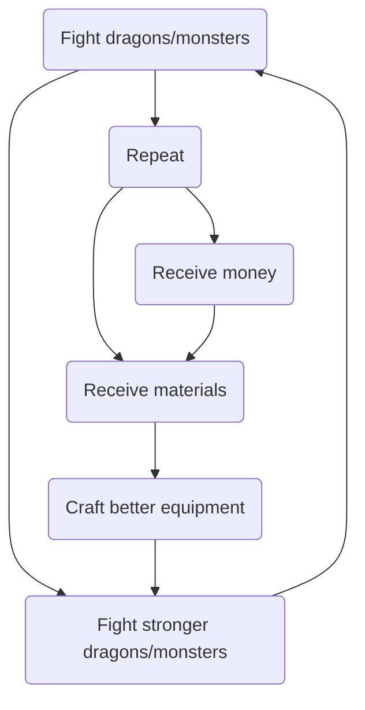

# A Monster Hunter Game

## Main Idea

The idea for the main quests would be similar to the *Monster Hunter* series, if you are familiar with it:

-   Fight dragons/monsters
-   Receive money/material after defeating dragons
    -   Use money to buy materials
-   Use materials to get better equipment with more damage/defense
-   Fight stronger dragons/monsters

## Fighting Mechanism

Assuming we are not doing anything graphical, except using console i/o:

-   It would basically be a typing game
-   Console would output a character at a time, and you would need to type that character correctly
    -   If you type it correctly:
        -   The monster take damage
        -   Damage scaled with your offensive items
        -   You receive money/material if monster's HP drops to 0
    -   If you type it incorrectly:
        -   You take damage
        -   Damage inverse-scaled with your defensive items
        -   You lose money/material if your HP drops to 0

## User Choices

-   You can only start fighting the next monster after defeating the previous monster
-   Each monster will have **3x** more HP than the previous monster
-   Upgrading items will give you **4x** more attack
-   You will have enough material to upgrade your item after defeating each monster around **5x**
-   User can decide to either:
    -   Keep fighting the next monster with lower tier items
    -   Fighting weaker monster repeatedly to get better items
        -   Not sure which way would be faster

\****Numbers are not finalized***

## Additional

-   Items might give bonus effect:
    -   Burn damage
    -   Percentage damage
    -   Reflect damage
    -   etc...
-   Items and monsters might have elemental type:
    -   **Water** blade deals bonus damage to **Fire** dragon...
-   Item might have different form:
    -   **Mallet** might only work against **Grounded** monsters
    -   Only **Bow/Arrow** can always hit a **Flying** dragon
-   Harder monsters might have **harder to type** characters:
    -   I (ice cream) vs. l (Laura) vs. 1(123) 
    -   O (capital oreo) vs. 0 (zero) vs. o (lower oreo)
    -   ~, |, ^ (symbols)

